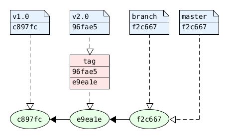

# Refs

Before we step in the details of git references we have to
initialize the repository.

```console
$ git init
```

Fist we create we create and commit a file and then we create
a tag:

```console
$ echo "tag" > file.txt && git add . && git commit -m "tag"
$ git tag v1.0
```

The tag resolves to a file that contains a sha1 hash, which is
an object-id that points to the commit which we tagged.

```console
$ cat .git/refs/tags/v1.0
b79ff6b4882e9037cf5c6db6978f6acc5e0e91c7

$ git cat-file -t b79ff6b4882e9037cf5c6db6978f6acc5e0e91c7
commit
```

Next we update and commit the file and create an annotated tag.

```console
$ echo "annotated-tag" > file.txt && git add . && git commit -m "annotated-tag"
$ git tag -a v2.0 -m "Tag v2.0"
```

The annotated tag also resolves to a file which contains an object-id. But this
object-id points to a tag object.

```console
$ cat .git/refs/tags/v2.0
bed95fed3540107442293c429b0f6455b6a7e865

$ git cat-file -t bed95fed3540107442293c429b0f6455b6a7e865
tag
```

The tag object containts the meta data of the tag and also an object-id which 
points to the commit:

```console
$ git cat-file -p bed95fed3540107442293c429b0f6455b6a7e865
object ccd9680bec94f38e9dae1e767ce63cd3c22f62e4
type commit
tag v2.0
tagger Dead End <test@test.com> 1686599041 +0200

Tag v2.0

$ git cat-file -t ccd9680bec94f38e9dae1e767ce63cd3c22f62e4
commit
```

The next we do is to create a branch.

```console
$ echo "branch" > file.txt && git add . && git commit -m "branch"
$ git branch branch
```
The branch resolves to a file with the object-id of the commit,
at which the branch points to.

```console
$ cat .git/refs/heads/branch
00bd87d06032397df48d33176758302e682a44b0

$ git cat-file -t 00bd87d06032397df48d33176758302e682a44b0
commit
```

At this point the result looks like this:



At this point all references are stored in separate file:

```console
$ find .git/refs -type f
.git/refs/heads/master
.git/refs/heads/branch
.git/refs/tags/v1.0
.git/refs/tags/v2.0
```

The next step is to call the garbage collector. One of the things that
the gc does is to pack the refs.

```console
$ git gc
```
After the garbage collector run, the reference files are gone.

```console
$ find .git/refs/
.git/refs/
.git/refs/heads
.git/refs/tags
```

The references are stored in .git/packed-refs` file. As the comment says
the enties are sorted by the refs and the refs are peeled, which means 
that annoteded tags are followed by the object-id of the commit.

```console
$ cat .git/packed-refs
# pack-refs with: peeled fully-peeled sorted
f2c6679f38b2bf8d5dc0f090a8a424d380b343fd refs/heads/branch
f2c6679f38b2bf8d5dc0f090a8a424d380b343fd refs/heads/master
c897fcef1ebd3179c4e166508166045e6d5bf4a0 refs/tags/v1.0
96fae537cfff7d797a21200dc1497e094d4fe0e9 refs/tags/v2.0
^e9ea1e0a0cd118317873f691a8cd015b9f78160d
```

What happens if we create a new branch? So lets find out:

```console
$ echo "next-branch" > file.txt && git add . && git commit -m "next-branch"
$ git branch next-branch
```

The branch is created as a refs file. The `.git/packed-refs` is untouched.
If a branch should be resolved, then git first looks to the reference files
and then to the packed-refs file. So the refs file overwrites the packed-refs.

```console
$ cat .git/refs/heads/next-branch
00bd87d06032397df48d33176758302e682a44b0

$ git cat-file -t 00bd87d06032397df48d33176758302e682a44b0
commit
```

If we delete a branch, which is part of the `.git/packed-refs` file, then
this file has to be updated:

```console
$ git branch --delete branch
Deleted branch branch (was 00bd87d).

$ cat .git/packed-refs 
# pack-refs with: peeled fully-peeled sorted 
00bd87d06032397df48d33176758302e682a44b0 refs/heads/master
b79ff6b4882e9037cf5c6db6978f6acc5e0e91c7 refs/tags/v1.0
bed95fed3540107442293c429b0f6455b6a7e865 refs/tags/v2.0
^ccd9680bec94f38e9dae1e767ce63cd3c22f62e4
```
