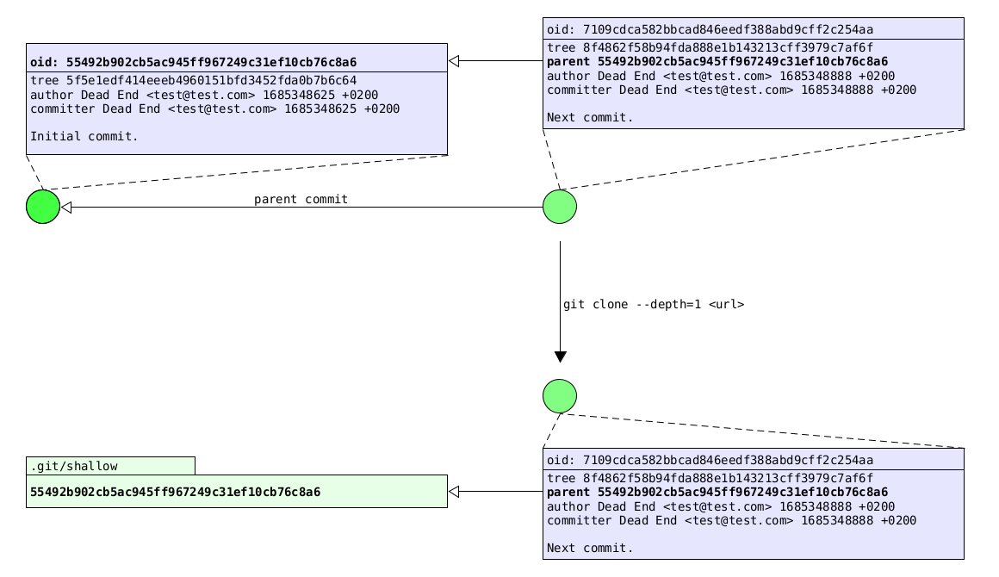

## DEV-DOC .git/shallow

### Shallow clone

Cloning a repositry means that you get every revision of every file ever committed.
On a large repository with a long history this can be a lot.

You can restrict the clone to a depth, which means that you truncate the history to
the specified number of commits.

```
git clone --depth 5 https://github.com/isomorphic-git/isomorphic-git'
```

Or with isomorphic-git:

```
await git.clone({
  fs,
  http,
  dir: '/tutorial',
  url: 'https://github.com/isomorphic-git/isomorphic-git',
  depth: 5
})
```

You can also restrict the clone to a certain branch:

```
git clone https://github.com/isomorphic-git/isomorphic-git' --branch main --single-branch
```

Or with isomorphic-git:

```
await git.clone({
  fs,
  http,
  dir: '/tutorial',
  url: 'https://github.com/isomorphic-git/isomorphic-git',
  singleBranch: true,
  ref: 'main'
})
```

You can combine the depth and the branch restrictions.

### Shallow commits

In your shallow repository you get commits which have parents in the origin repository
but not in the clone. So you cannot simply follow parent commits in a shallow repository.

To solve this problem the `.git/shallow` file exist. It contains a list of commit hashes,
which are delimited with a newline character.

A commit, which has a parent commit which is contained in the `.git/shallow` file, should be
interpreted as a root commit, which has no parent.



### Isomorphic-git

Isomorphic-git has a `GitShallowManager` to access the hashes in the `.git/shallow` file, with two static functions:

```
GitShallowManager.read({ fs, gitdir })

GitShallowManager.write({ fs, gitdir, oids })
```
